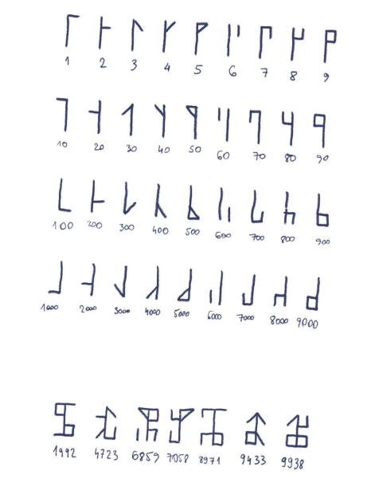
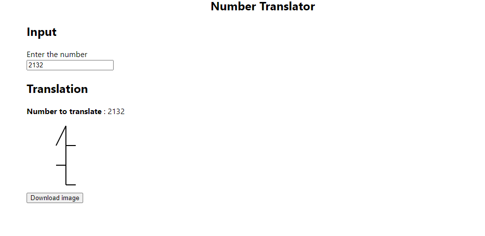

# Translator

> Translating a number between 0 and 9999 included to a specific graphic.

Simple React.js app helping to translate a number to its specific code.

## Built With

- Yarn
- React.js
- D3.js
- Typescript

## Live Demo

## Getting Started

### Prerequisites

You must have installed

- Node.js
- Yarn

### Setup

Clone the repository
`git clone https://github.com/maelfosso/translate-number`

Change  the directory
`cd translate-number`

Start it

- `yarn install`
- `yarn start`

## Authors

- GitHub: [@maelfosso](https://github.com/maelfosso)
- Twitter: [@maelfosso](https://twitter.com/maelfosso)
- LinkedIn: [LinkedIn](https://www.linkedin.com/in/mael-fosso-650b6346/)

## 📝 License

This project is [MIT](./MIT.md) licensed.
